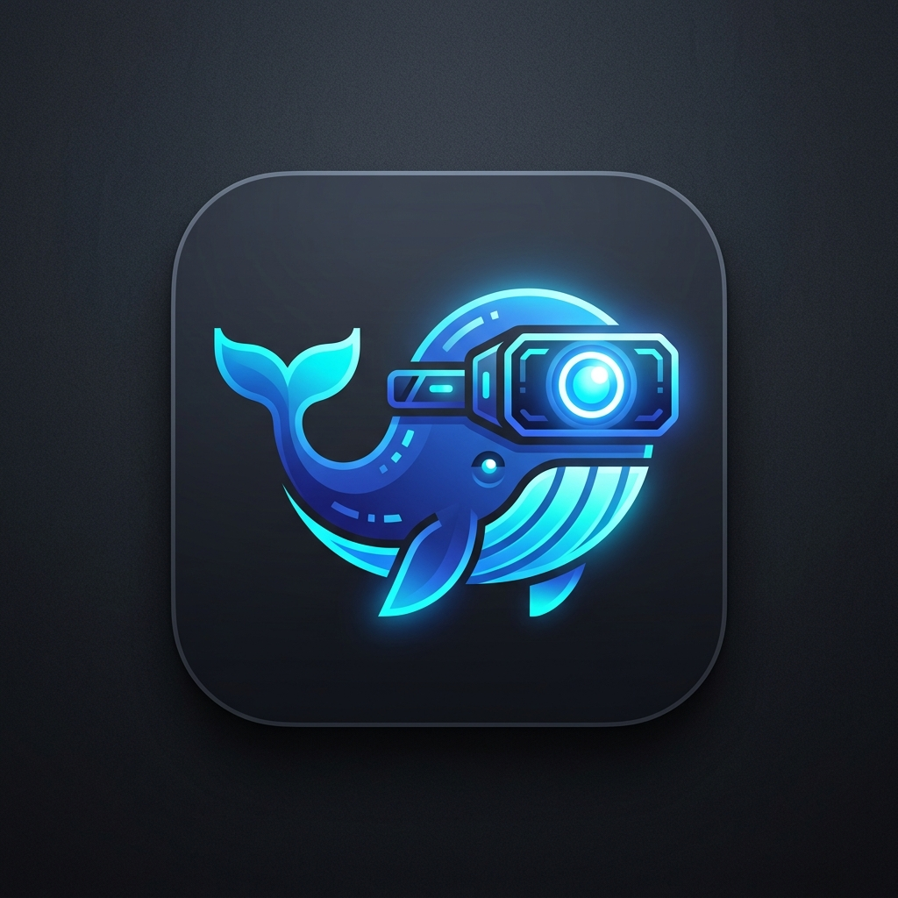

<div align="center">
  
  <h1>dsh-image-describer</h1>
  <p><strong>Giving text models eyes to see in DeepSeek Harness.</strong></p>
  <p>让纯文本模型也能“看见”世界。</p>
  <p>
    <a href="#english">English</a> | <a href="#chinese">中文</a>
  </p>
</div>

---

<a id="english"></a>

## English

> **Giving text models eyes to see in DeepSeek Harness.**

`dsh-image-describer` is a native plugin for [DeepSeek Harness](https://deepseek-harness.github.io/deepseek-harness/) that provides **dual-mode visual understanding capabilities** for text-only LLMs (such as `deepseek-v4-flash`, `deepseek-v4-pro`).

---

### 🌟 Dual-Mode Architecture

The plugin seamlessly supports two complementary visual interaction scenarios: **Direct UI Chat Image Pasting (Attachment Mode)** and **Active File Inspection (Tool Mode)**.

```
                                    ┌── Scenario 1: Paste image directly in UI ────➔ Automatically transcribes into structured context
User provides visual input in DSH ──┤
                                    └── Scenario 2: Mention image file in chat ─────➔ Model actively invokes `describe_image` tool
```

---

#### Scenario 1: Direct UI Chat Image Pasting (Attachment Mode)

* **User Action**: Direct `Ctrl + V` screenshot paste or drag-and-drop into the chat box.
* **Workflow**:
  1. The image enters the session as an `ImageBlock` attachment in the user's message.
  2. The plugin intercepts the request at the DSH `llm/stream` pipeline.
  3. The plugin calls the configured multimodal vision model (default `MiniMax-M3`) for OCR and comprehensive visual recognition.
  4. The plugin replaces the `ImageBlock` with an explicit, structured system prompt:
     ```text
     [System Notice: The user uploaded/pasted an image in chat (non-workspace file, fully transcribed by visual model MiniMax-M3). Please answer directly based on the recognition results below, without searching workspace files or calling tools:
     <Transcribed visual content and OCR text>
     ]
     ```
  5. The text-only model receives clean context and responds immediately without crashing or unnecessary workspace searches.

---

#### Scenario 2: Active Tool Calling on Local Files (Tool Mode)

* **User Action**: Mentioning local image file paths in the conversation, for example:
  > "Analyze the microservice architecture in `assets/architecture.png`."  
  > "What is the error code in the bottom-left corner of `Screenshot.png`?"
* **Workflow**:
  1. The text model actively invokes the **`describe_image`** tool:
     ```json
     {
       "filePath": "assets/architecture.png",
       "prompt": "Analyze the service dependencies and data flow in detail."
     }
     ```
  2. The `describe_image` tool reads the local image file, saves it as an attachment, and calls the vision model.
  3. The vision model analyzes the image according to the model's custom prompt and returns the result.
  4. The model uses the structured tool result to answer the user's question.
  5. The tool call arguments and result are visible in the Web UI tool card.

---

### 🛠️ Prerequisite: Enable Image Modality for Text Models

The DSH Web UI and API gateway check whether the current model declares `image` input modality. To allow pasting images in UI and reading files, declare `input: [text, image]` in `~/.dsh/settings.yaml`:

```yaml
llm-pi-ai:
  providers:
    minimax-cn:
      apiKeyEnv: MINIMAX_CN_API_KEY
    opencode-go:
      apiKeyEnv: OPENCODE_GO_API_KEY
      modelOverrides:                 # Override built-in models
        deepseek-v4-flash:
          input: [text, image]
        deepseek-v4-pro:
          input: [text, image]
    opencode-go2:
      apiKeyEnv: OPENCODE_GO2_API_KEY
      api: openai-completions
      baseURL: https://opencode.ai/zen/go/v1
      models:
        - id: deepseek-v4-flash
          input: [text, image]
        - id: deepseek-v4-pro
          input: [text, image]
```

---

### 📦 Installation

#### 1. Build
```bash
pnpm install
pnpm run build   # tsc builds to lib/
```

#### 2. Link to DSH Web Profile
```bash
# Add this plugin to web profile
npx @deepseek-ai/dsh plugin --profile web add ./dsh-image-describer

# Start DSH Web
dsh web --profile web
```

#### 3. Uninstall (if needed)
```bash
npx @deepseek-ai/dsh plugin --profile web remove dsh-image-describer
```

---

### ⚙️ Configuration

Configure the plugin in your profile's `cordis.patch.yml`:

```yaml
- insert:
    - id: image-describer-tool
      name: dsh-image-describer
      inject: [tools, llm, attachments]
      config:
        provider: minimax-cn       # Multimodal provider route
        model: MiniMax-M3          # Vision model ID (must support image input)
        maxTokens: 2048            # Max output tokens per description
        timeoutMs: 60000           # Timeout in milliseconds
```

| Option | Type | Default | Description |
|---|---|---|---|
| `provider` | `string` | `minimax-cn` | Vision model provider route (configure API key in `settings.yaml`) |
| `model` | `string` | `MiniMax-M3` | Vision model ID (must support image input) |
| `prompt` | `string` | Chinese detailed prompt | Default prompt used when caller doesn't specify a specific question |
| `maxTokens` | `number` | `2048` | Max output tokens per analysis |
| `timeoutMs` | `number` | `60000` | Analysis timeout in milliseconds |

---

### 👨‍💻 Local Development

```bash
pnpm run clean   # Clean lib/ output
pnpm run build   # Compile TypeScript
```

---
---

<a id="chinese"></a>

## 中文

> **让纯文本模型也能“看见”世界。**

`dsh-image-describer` 是专为 [DeepSeek Harness](https://deepseek-harness.github.io/deepseek-harness/) 打造的原生插件，为 DeepSeek 等**纯文本 LLM**（如 `deepseek-v4-flash`、`deepseek-v4-pro`）提供**双模视觉理解能力**。

---

### 🌟 双模工作机制详解

本插件支持两种互补的视觉交互场景：**聊天框直接粘贴图片（附件模式）** 和 **对话中主动调用工具（Tool 模式）**。

```
                                    ┌── 场景 1: UI 聊天框直接粘贴图片 ──➔ 自动转写为【结构化上下文】秒出回答
用户在 DeepSeek 中使用图片 ────────┤
                                    └── 场景 2: 对话中提及图片文件 ────➔ 模型主动调用 describe_image 工具进行定向分析
```

---

#### 场景一：聊天框直接粘贴图片（会话附件模式）

* **用户操作**：在 Web UI 聊天输入框直接 **`Ctrl + V` 粘贴屏幕截图**，或**把图片拖入输入框**发送。
* **底层运行流程**：
  1. 图片作为会话附件（`ImageBlock`）附带在用户消息体中。
  2. 插件在 DSH 底层的 `llm/stream` 消息流水线处自动拦截该请求。
  3. 插件自动调用配置的多模态视觉模型（默认 `MiniMax-M3`）对图片进行完整的 OCR 文字提取与版面内容理解。
  4. 插件将 `ImageBlock` 替换为带有明确引导词的系统提示：
     ```text
     [系统提示：用户在聊天中直接上传/粘贴了图片（非本地工作区文件，已由视觉模型 MiniMax-M3 完整识别解析）。请直接基于以下识别结果回答用户的问题，无需在本地文件系统中搜索该图片或再次调用工具：
     <视觉模型返回的深度内容描述与 OCR 文字>
     ]
     ```
  5. 纯文本模型收到该提示后，清楚知晓“这是用户粘贴的图片内容”，**直接基于识别文字给出精准回答**，不会产生多余的本地文件搜索，也不会因接收二进制图片而崩溃。

---

#### 场景二：对话中提及图片文件（主动 Tool Call 模式）

* **用户操作**：在对话中发送工作区内的图片路径或让模型查看某个文件，例如：
  > “帮我分析一下项目里的 `assets/architecture.png` 架构图。”  
  > “查看 `Screenshot.png` 中左下角的报错代码是什么。”
* **底层运行流程**：
  1. 纯文本模型在思考链中识别到用图需求，**自主触发 `describe_image` 工具调用**：
     ```json
     {
       "filePath": "assets/architecture.png",
       "prompt": "详细分析图中的微服务架构及组件依赖关系"
     }
     ```
  2. `describe_image` 工具读取工作区本地文件，提交给多模态视觉模型进行针对性分析。
  3. 工具将识别结果作为结构化结果（Tool Result）返回给模型。
  4. 模型基于工具返回的分析结果，结合上下文完成推理并给出回答。
  5. 调用过程与参数在 Web UI 的工具卡片中完全透明可见。

---

### 🛠️ 前置准备：开启纯文本模型的图片通道

DeepSeek Harness 的 Web UI 和 API 网关会在最外层检查模型是否声明了 `image` 模态。为了让前端允许粘贴图片、文件工具允许读图，需要在全局配置文件 `~/.dsh/settings.yaml` 中为你使用的纯文本模型开启声明：

```yaml
llm-pi-ai:
  providers:
    minimax-cn:
      apiKeyEnv: MINIMAX_CN_API_KEY
    opencode-go:
      apiKeyEnv: OPENCODE_GO_API_KEY
      modelOverrides:                 # 👈 为内置模型声明模态
        deepseek-v4-flash:
          input: [text, image]
        deepseek-v4-pro:
          input: [text, image]
    opencode-go2:
      apiKeyEnv: OPENCODE_GO2_API_KEY
      api: openai-completions
      baseURL: https://opencode.ai/zen/go/v1
      models:
        - id: deepseek-v4-flash
          input: [text, image]
        - id: deepseek-v4-pro
          input: [text, image]
```

---

### 📦 安装与挂载

#### 1. 编译构建
```bash
pnpm install
pnpm run build   # tsc 编译输出到 lib/ 目录
```

#### 2. 挂载到 DSH Web Profile
```bash
# 将本插件软链接安装到 DSH web profile
npx @deepseek-ai/dsh plugin --profile web add ./dsh-image-describer

# 启动 DSH
dsh web --profile web
```

#### 3. 卸载插件（如需）
```bash
npx @deepseek-ai/dsh plugin --profile web remove dsh-image-describer
```

---

### ⚙️ 配置项说明

在 Profile 的 `cordis.patch.yml` 中进行声明或覆盖：

```yaml
- insert:
    - id: image-describer-tool
      name: dsh-image-describer
      inject: [tools, llm, attachments]
      config:
        provider: minimax-cn       # 多模态提供方路由
        model: MiniMax-M3          # 视觉模型 ID（必须支持图片输入）
        maxTokens: 2048            # 单次图片分析的最大 Token 上限
        timeoutMs: 60000           # 单次图片分析超时时间（毫秒）
```

| 配置字段 | 类型 | 默认值 | 说明 |
|---|---|---|---|
| `provider` | `string` | `minimax-cn` | 视觉描述者 Provider 路由（需在 `settings.yaml` 中配置 API Key） |
| `model` | `string` | `MiniMax-M3` | 视觉描述者模型 ID（必须为支持图像输入的多模态模型） |
| `prompt` | `string` | 中文详细描述模板 | 默认分析提示词模板（当调用方未指定具体问题时使用） |
| `maxTokens` | `number` | `2048` | 单次图片分析的最大输出 Token 上限 |
| `timeoutMs` | `number` | `60000` | 单次图片分析的超时时间（毫秒） |

---

### 👨‍💻 本地开发

```bash
pnpm run clean   # 清空 lib/ 产物
pnpm run build   # 重新编译 TypeScript 源码
```

---

## 📄 开源许可证 / License

MIT License